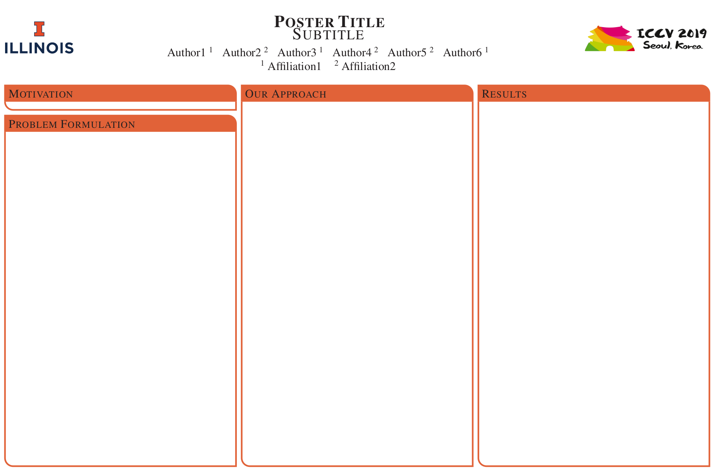

# About
Some templates that I have collected and customized. Use Makefile in each directory to build (if included)

| Name               | Description                                     | Thumbnail                            |
|--------------------|-------------------------------------------------|--------------------------------------|
| `markdown_beamer`  | Generate slides from markdown. Require `pandoc` |   |
| `uiuc_beamer`      | Beamer slides with UIUC theme                   |       |
| `uiuc_powerpoint`  | Powerpoint slides with UIUC theme               |                                      |
| `uiuc_libreoffice` | Libreoffice (Impress) slides with UIUC theme    |  |
| `uiuc_poster`      | Latex poster with UIUC theme                    |       |
